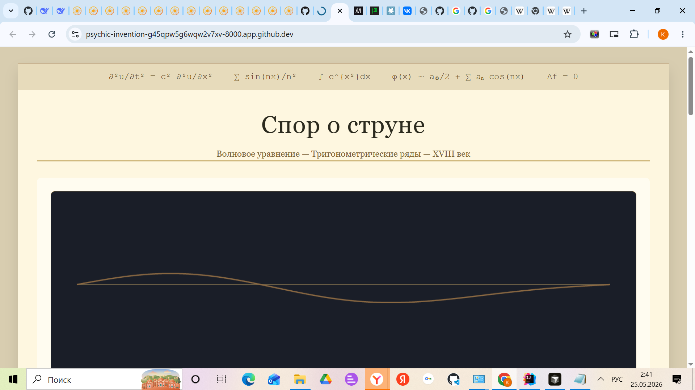
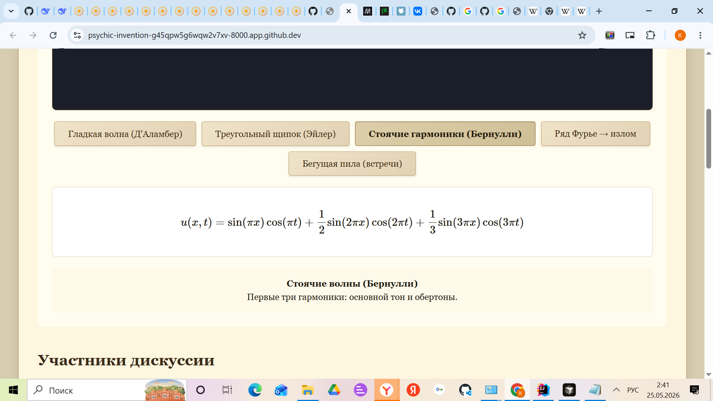
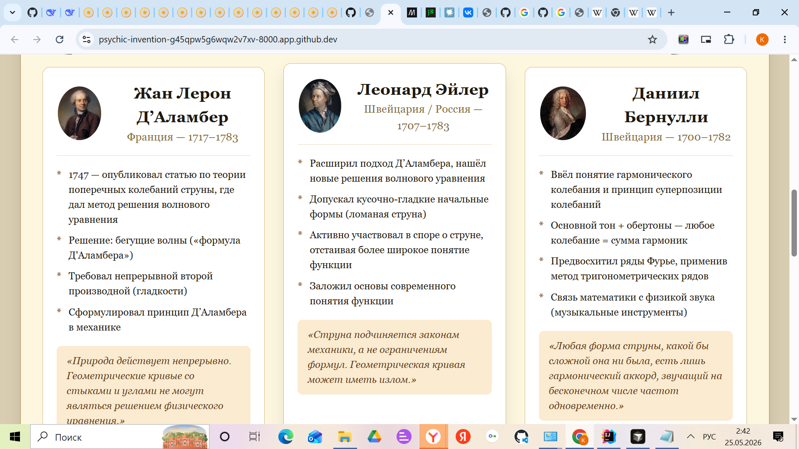

# Спор о струне — интерактивный учебник

Веб-страница, посвящённая историческому научному спору XVIII века о колебаниях струны (волновое уравнение, тригонометрические ряды, понятие функции). Проект представляет собой самодостаточный HTML-файл с анимацией, биографическими карточками, сравнительной таблицей и видео-пояснением.

## Содержание

- Анимация струны на canvas с 5 режимами (гладкая волна, треугольный щипок, стоячие гармоники, ряд Фурье, бегущая пила)
- Карточки учёных: Жан Лерон Д’Аламбер, Леонард Эйлер, Даниил Бернулли (портреты, даты жизни, вклад в спор, цитаты)
- Таблица сравнения научных позиций по 4 критериям
- Видео-ролик о теории струн (Rutube)
- Адаптивный дизайн для мобильных устройств

## Запуск

### Самый простой способ
1. Скачайте файл `index.html` (или `string_dispute.html`) в любую папку.
2. Дважды кликните по файлу — он откроется в браузере по умолчанию.

### Альтернативный способ через локальный сервер (рекомендуется)

# Если у вас установлен Python
python3 -m http.server 8000
# или
python -m http.server 8000

# Затем откройте в браузере адрес http://localhost:8000

Структура проекта
Проект состоит из одного файла — index.html, который содержит всю разметку, стили, скрипты и встроенные ресурсы (кроме внешних изображений и видео).

Лицензия:

Все изображения используются в соответствии с лицензией Creative Commons (авторские права принадлежат оригинальным авторам, ссылки указаны в коде). Проект создан в образовательных целях.

Автор:

Создано в рамках учебной задачи. При необходимости доработок — обращайтесь.

## ▶ Как использовать

1. **Сохраните HTML-код** (последний полный код из предыдущего сообщения) в файл с именем `index.html`.
2. **Сохраните Makefile** в той же папке как `Makefile` (без расширения).
3. **Сохраните README.md** в той же папке как `README.md`.
4. В терминале (в папке с файлами) выполните:
   - `make open` — чтобы открыть страницу в браузере;
   - `make serve` — чтобы запустить локальный сервер (удобно, если нужно проверить загрузку внешних ресурсов без CORS).

Может грузится долго, но работать должно.

